# AsterNova Hospital Intelligence Platform

A full-stack, portfolio-grade hospital management and intelligence platform.

> **All data is fictional.** Every patient, clinician, staff member, insurer,
> manufacturer, policy and clinical record in this project is generated demo
> data created for demonstration purposes. No real person or medical record is
> represented, and nothing here is a medical device or clinical decision tool.

---

## Overview

AsterNova is a fictional 350-bed multispeciality hospital in Kochi, Kerala,
modelled end to end: front desk registration, OPD and emergency care, inpatient
admissions and bed management, laboratory and radiology, pharmacy and
prescriptions, operation theatre, blood bank, billing, insurance, medical
documents with OCR, AI document intelligence and retrieval-augmented search.

The emphasis is on **working integration over screenshots**: registering a
patient writes to PostgreSQL and immediately changes the dashboard counts;
admitting a patient occupies a bed and releases it on discharge; dispensing a
prescription decrements pharmacy stock inside a transaction; uploading a PDF
extracts its text, indexes it for retrieval and produces an administrative
summary.

## Features

| Area | What is implemented |
| --- | --- |
| Authentication | JWT (access + refresh with rotation and blacklisting), email or username login, password change, session-expiry handling |
| RBAC | 13 roles, a configurable role→module→action permission matrix editable from the UI, plus object-level scoping (patients see only their own records; clinicians see their patients) |
| Patients | Registration with validation, clinical profile, full cross-module chronological timeline, vitals, nurse assignments |
| Clinical flow | Appointments (with double-booking prevention), OPD consultations, emergency triage board with live waiting times, admissions, discharge workflow with a 7-step clearance checklist |
| Bed management | 350 seeded beds across 9 wards, live occupancy, visual bed board, assign/release/maintenance actions |
| Diagnostics | 20-test laboratory catalogue with reference-range flagging (normal/high/low), radiology studies and reports |
| Pharmacy | 40 medicines with derived stock status, prescriptions with line items, transactional dispensing that refuses to oversell |
| Surgery | Theatre scheduling with clash detection per theatre and time window |
| Blood bank | Stock per group with critical thresholds, donations (stock-increasing), issue records with reservation logic |
| Billing | Invoices with line items, discount/tax/insurance calculation, partial payments, payment status derivation |
| Insurance | Fictional providers, patient policies, claims with review/approval/rejection/settlement workflow |
| Inventory | Suppliers, 28 stock items, purchase orders with receiving (which increases stock and writes stock movements) |
| Documents + OCR | PDF/PNG/JPG upload with type, size and filename validation, OpenCV preprocessing, Tesseract OCR, pypdf text extraction, SHA-256 duplicate detection |
| AI intelligence | Document summarisation, medication/lab-value/date extraction, classification — strictly administrative, never diagnostic |
| RAG | Text chunking → local hashed embeddings → vector store → similarity search → grounded answers with source references |
| AI assistant | Operational Q&A over authorised data (appointments, beds, emergency, lab backlog, admissions by department, stock, claims, revenue, shifts, surgery, blood bank) and a document assistant that quotes its sources |
| Analytics | 12 live KPIs and 8 charts, plus least-squares forecasts for patient volume, OPD, emergency load, laboratory workload, bed occupancy and pharmacy demand |
| Audit | Append-only trail of who did what, to which object, from which IP, with a safety-net entry for every mutating API call |
| Search | Global search across patients, doctors, appointments, documents, departments, laboratory, medicines and bills — filtered by the caller's permissions |
| Navigation | Indoor wayfinding with searchable destinations, a schematic floor plan and step-free route instructions |
| Demo experience | One-command seeder, 13 documented demo logins, "DEMO DATA ONLY" indicator, presentation-friendly dashboard |

### Editing workflows

The generic resource screen (`src/components/ResourcePage.jsx`) powers most
modules and supports:

- **Repeatable line items** — invoices, prescriptions and purchase orders are
  built with add/remove rows for billable services, medicines and stock lines;
  totals are calculated server-side from those rows.
- **Workflow actions per row** — dispense (decrements pharmacy stock), record
  payment, receive a purchase order (increases stock and writes stock
  movements), and approve/complete a discharge (releases the bed).
- **Server-side validation surfaced inline** — field errors from the API are
  rendered against the form instead of a generic failure message.

### AI safety boundary

The AI layer is deliberately limited to **organising, summarising and
retrieving** information that already exists in the records. It does not
diagnose, prescribe, recommend treatment or make autonomous clinical decisions,
and every response is accompanied by:

> AI-generated information is for administrative and information-support
> purposes only and must be reviewed by an authorized healthcare professional.

## Architecture

```
frontend/  React 19 + Vite + Material UI + Recharts + Axios + React Router
   src/components   shared layout, tables, dialogs, generic resource screen
   src/pages        dashboard, patients, bed board, emergency, documents, AI,
                    analytics, navigation, roster, settings, portal, admin, ...
   src/charts       chart primitives built on Recharts
   src/services     axios client, token refresh, endpoint map
   src/hooks        useResource (lists, filters, pagination, CRUD)
   src/context      auth context with permission helpers

backend/   Django + Django REST Framework
   config/          settings, URL routing, pagination, error envelope, viewsets
   users/           custom user, roles, permission matrix, object scoping, JWT
   hospital/        hospital profile, departments, floors, indoor map, seeder
   patients/        patient index, vitals, nurse assignments, timeline
   doctors/ staff/  clinician and workforce registries, shifts and rosters
   appointments/ opd/ emergency/ admissions/ beds/
   laboratory/ radiology/ pharmacy/ surgery/ bloodbank/
   documents/       upload, OCR, AI summary, RAG (chunk, embed, search)
   ai_assistant/    hospital assistant engine and chat history
   billing/ insurance/ inventory/ notifications/ analytics/ audit/
```

Every module exposes a REST API under `/api/<module>/` with consistent
pagination (`count`, `num_pages`, `page`, `results`) and a normalised error
envelope (`detail`, `code`, `errors`) so the UI can always show a friendly
message instead of a stack trace.

## Technology stack

**Backend** Python 3.12+, Django, Django REST Framework, SimpleJWT, PostgreSQL
(SQLite fallback), Pillow, pypdf, OpenCV, pytesseract, psycopg.
**Frontend** React, JavaScript, Material UI, Axios, React Router, Recharts, Vite.
**Ops** Docker, Docker Compose, nginx, Gunicorn.

## Installation

### Backend

```bash
cd backend
python -m venv ../.venv
../.venv/Scripts/activate          # Windows
pip install -r requirements.txt
cp ../.env.example ../.env         # then edit the values
python manage.py migrate
python manage.py seed_demo_data
python manage.py runserver 8000
```

### Frontend

```bash
cd frontend
npm install
npm run dev                        # http://localhost:5173
```

The Vite dev server proxies `/api` and `/media` to `http://127.0.0.1:8000`, so
no CORS configuration is needed during development.

### Docker

```bash
cp .env.example .env
docker compose up --build
```

Frontend on <http://localhost:8080>, backend on <http://localhost:8000/api/>.
The backend container runs migrations and seeds the demo dataset on start.

## Environment variables

See [`.env.example`](.env.example) for the full list with comments. The important
ones:

| Variable | Purpose |
| --- | --- |
| `DJANGO_SECRET_KEY` | Django secret; generate a unique value for any non-demo use |
| `DJANGO_DEBUG` | `True` locally, `False` in production (enables HSTS/SSL redirects) |
| `DB_ENGINE` | `sqlite` (default) or `postgres` |
| `POSTGRES_*` | Database connection details when `DB_ENGINE=postgres` |
| `DEMO_PASSWORD` | Password for all seeded demo accounts |
| `AI_PROVIDER` | `demo` (local, no key needed) or `openai` |
| `OPENAI_API_KEY` | Only read when `AI_PROVIDER=openai`; never hard-code it |
| `TESSERACT_CMD` | Full path to Tesseract when it is not on `PATH` |
| `MAX_UPLOAD_SIZE_MB` | Upload size ceiling enforced server-side |

No API key is required to run or demonstrate the platform: `AI_PROVIDER=demo`
uses a deterministic local engine for summaries and a local embedding model for
RAG retrieval.

## Database

```bash
python manage.py makemigrations      # after model changes
python manage.py migrate             # apply migrations
python manage.py seed_demo_data      # create/refresh the demo dataset
python manage.py seed_demo_data --reset          # wipe demo data first
python manage.py seed_demo_data --skip-documents # skip PDF/OCR generation
python manage.py test                # run the test suite
```

`seed_demo_data` is safe to run repeatedly: records are written with
`update_or_create` against stable business keys, so no duplicates accumulate.

## Demo credentials

Every account uses the password from `DEMO_PASSWORD`
(default `AsterNova@2024`). These are **local/demo credentials only**.

| Role | Email |
| --- | --- |
| Super Admin | superadmin@asternova.demo |
| Hospital Admin | admin@asternova.demo |
| HOD (Cardiology) | hod@asternova.demo |
| Doctor (Neurology) | doctor@asternova.demo |
| Nurse | nurse@asternova.demo |
| Receptionist | reception@asternova.demo |
| Laboratory Technician | lab@asternova.demo |
| Radiologist | radiologist@asternova.demo |
| Pharmacist | pharmacist@asternova.demo |
| Billing Staff | billing@asternova.demo |
| Insurance Staff | insurance@asternova.demo |
| Inventory Manager | inventory@asternova.demo |
| Patient | patient@asternova.demo |

`GET /api/auth/demo-accounts/` returns the same list (and the demo password)
while `DEMO_MODE=True`, which is how the login screen offers one-click sign-in.

## Demo dataset

| Entity | Count |
| --- | --- |
| Departments | 20 (with named HODs) |
| Doctors | 60 |
| Staff | 152 |
| Patients | 478 |
| Beds | 350 across 9 wards |
| Appointments | ~700 |
| Laboratory reports | ~850 |
| Radiology studies | ~730 |
| Prescriptions | ~780 |
| Surgeries | 140 |
| Medical documents | ~330 (real PDFs, OCR'd and indexed) |
| Invoices / insurance claims | ~780 / ~220 |
| Audit entries | 70 |

## API documentation

All endpoints are mounted under `/api/` and require a JWT
(`Authorization: Bearer <access>`) except `/api/auth/login/` and
`/api/auth/demo-accounts/`.

| Base path | Module |
| --- | --- |
| `/api/auth/` | login, refresh, logout, me, change-password, demo-accounts |
| `/api/users/` `/api/users/roles/` | accounts, roles and permission editing |
| `/api/hospital/` `/api/departments/` | hospital profile, departments |
| `/api/hospital/status/` | runtime configuration (OCR engine, AI provider, upload limits, security) |
| `/api/doctors/` `/api/staff/` | clinicians, staff, shifts, rosters |
| `/api/patients/` | patients, `stats/`, `{id}/timeline/`, `{id}/overview/`, vitals, nurse-assignments |
| `/api/appointments/` `/api/opd/` | booking diary, consultations |
| `/api/emergency/` | cases, `board/`, `stats/` |
| `/api/admissions/` `/api/beds/` | admissions, discharge summaries, bed board |
| `/api/laboratory/` `/api/radiology/` | tests, orders, results, studies |
| `/api/pharmacy/` | medicines, `stats/`, prescriptions, `dispense/` |
| `/api/surgery/` `/api/blood-bank/` | theatre schedule, blood stock/donations/issues |
| `/api/documents/` | upload, `process/`, `summary/`, `search/`, `duplicates/`, `ocr_status/` |
| `/api/ai/` | `capabilities/`, `ask/`, `documents/ask/`, `sessions/` |
| `/api/billing/` `/api/insurance/` | invoices with payments, claims |
| `/api/inventory/` `/api/notifications/` `/api/audit/` `/api/analytics/` | stock, alerts, audit trail, dashboard/charts/forecast |
| `/api/search/` | global search across authorised modules |
| `/api/navigation/` | indoor directions |

Useful demo endpoints:

```bash
curl http://127.0.0.1:8000/api/auth/demo-accounts/
curl -X POST http://127.0.0.1:8000/api/auth/login/ \
  -H "Content-Type: application/json" \
  -d '{"identifier":"admin@asternova.demo","password":"AsterNova@2024"}'
curl http://127.0.0.1:8000/api/analytics/dashboard/ -H "Authorization: Bearer <access>"
curl "http://127.0.0.1:8000/api/ai/ask/?question=beds" -H "Authorization: Bearer <access>"
```

## OCR setup

1. Install Tesseract (<https://tesseract-ocr.github.io/>) and note the binary path.
2. Set `TESSERACT_CMD` in `.env` if it is not on `PATH`.
3. Restart the backend and check `GET /api/documents/ocr_status/`.

The pipeline is: **upload → validate → OpenCV preprocess → Tesseract (images) or
pypdf (PDF text layer) → store extracted text → summarise → index for retrieval →
display**. Document status moves through Uploaded → Processing → Completed or
Failed, and failures are explained in the UI rather than hidden. When Tesseract
is absent the platform still reads PDF text layers and clearly labels the OCR
engine as unavailable.

## RAG explained

1. Extracted text is split into overlapping word windows (900 words, 150 overlap).
2. Each chunk is embedded with a deterministic hashing vectoriser
   (`EMBEDDING_DIMENSIONS`, default 256) and stored in `DocumentChunk.embedding`.
3. A question is embedded with the same function and compared using cosine
   similarity (`RAG_TOP_K` results).
4. The answer is composed **only** from the retrieved passages, and every answer
   returns the document references used, so it can be verified against the source.

Retrieval is restricted to documents the caller can already see: the RAG layer is
never given a queryset wider than the user's permissions allow.

## Security notes

- JWT access/refresh tokens with rotation and blacklisting; refresh happens once
  on a 401 and the original request is replayed.
- Passwords hashed with Django's password hashers and validated against the
  configured validators; the test suite uses a fast hasher for speed only.
- Role-based access control on every viewset plus object-level scoping, so
  permission mistakes cannot leak another patient's record.
- Upload validation covers extension, declared MIME type, size and filename
  sanitisation before any file touches the filesystem.
- Consistent error envelope: internal errors are logged server-side and never
  returned to the client.
- Rate limiting on authentication and AI endpoints.
- Audit logging for every mutating API call, with IP and device context.
- Secrets live in environment variables only; `.env` is git-ignored and
  `.env.example` contains placeholders.

## Testing

```bash
cd backend
python manage.py test
```

**55 backend tests** cover authentication and token handling, the permission
matrix, object-level patient scoping, patient registration validation, invoice
and payment calculations, transactional prescription dispensing, document upload
validation, the OCR/AI/RAG pipeline, hospital settings permissions and the
assistant's answers (including the requirement that it refuses questions outside
the caller's permissions).

**31 end-to-end tests** drive the real UI in Chromium:

```bash
cd frontend
npm run e2e            # headless, against the running dev server
npm run e2e:ui         # interactive
npm run e2e:report     # open the HTML report
```

They sign in through the real login form, register a patient and prove the
record persists by searching for it, open a patient profile, walk all 20 module
screens looking for error states, ask the AI assistant an operational question
and check the safety disclaimer, exercise the RAG document assistant, and assert
the sidebar never overlaps page content on desktop.

## Continuous integration

`.github/workflows/ci.yml` runs three jobs on every push and pull request:

1. **Backend** — installs Tesseract, runs `manage.py check`, migrates PostgreSQL,
   seeds the demo dataset, runs the 55 tests and then performs a seeded API smoke
   test (login + dashboard assertions) so a broken seeder fails the build.
2. **Frontend** — `npm ci`, production build and lint.
3. **End-to-end** — boots Django and the Vite dev server, then runs the Playwright
   suite and uploads the HTML report as a build artifact.

## Deployment Guide

AsterNova is production-ready for deployment to GitHub, Vercel (Frontend), and cloud hosting (Backend).

### 1. Push to GitHub

Initialize the repository and push to your GitHub account:

```bash
# Initialize git repository
git init -b main

# Stage and commit all clean files
git add .
git commit -m "feat: initial commit of AsterNova Hospital Intelligence Platform"

# Link your GitHub repository and push
git remote add origin https://github.com/<your-username>/<your-repo-name>.git
git push -u origin main
```

> **Note:** `.gitignore` automatically prevents sensitive files (`.env`, `db.sqlite3`), virtual environments (`.venv/`), and build artifacts (`node_modules/`, `dist/`, `*.log`) from being committed.

---

### 2. Deploy Frontend to Vercel

The frontend is a Vite SPA preconfigured with `vercel.json` for client-side routing, asset caching, and security headers.

#### Option A: Via Vercel Dashboard (Recommended)
1. Go to [vercel.com/new](https://vercel.com/new) and import your GitHub repository.
2. Configure project settings:
   - **Framework Preset:** `Vite`
   - **Root Directory:** `./` (or `frontend` if deploying frontend only)
   - **Build Command:** `npm --prefix frontend run build` (or `npm run build` if Root Directory is `frontend`)
   - **Output Directory:** `frontend/dist` (or `dist` if Root Directory is `frontend`)
3. Add Environment Variable:
   - `VITE_API_BASE`: `https://your-backend-api-url.com/api`
4. Click **Deploy**.

#### Option B: Via Vercel CLI
```bash
# Install Vercel CLI globally
npm i -g vercel

# Deploy from repository root
vercel --prod
```

---

### 3. Deploy Backend (Django REST API)

Deploy the backend to any modern container platform or Python host:

#### Option A: Docker / Container (Render / Railway / Fly.io / AWS)
1. Deploy using the included `backend/Dockerfile`.
2. Set the following environment variables on your cloud provider:
   ```env
   DJANGO_SECRET_KEY=generate-a-strong-secret-key-here
   DJANGO_DEBUG=False
   DJANGO_ALLOWED_HOSTS=your-backend-domain.com
   DJANGO_CSRF_TRUSTED_ORIGINS=https://your-frontend.vercel.app
   CORS_ALLOWED_ORIGINS=https://your-frontend.vercel.app
   DB_ENGINE=postgres
   POSTGRES_DB=asternova
   POSTGRES_USER=asternova_user
   POSTGRES_PASSWORD=your_secure_password
   POSTGRES_HOST=your_db_host
   POSTGRES_PORT=5432
   DEMO_MODE=False
   ```
3. The Docker container automatically applies migrations, seeds initial data, and boots Gunicorn on port `8000`.

#### Option B: Local / VPS Quick Start with Docker Compose
```bash
docker compose up -d --build
```
- Frontend: `http://localhost:8080` (production) or `http://localhost:5173` (dev)
- Backend API: `http://localhost:8000/api/`
- Health Check: `http://localhost:8000/api/health/`

---

## Project structure

```
aimedicalreport/
├── backend/            Django project and 23 apps
├── frontend/           React single-page application (Vite + MUI)
├── .github/workflows/  GitHub Actions CI (backend, frontend, E2E)
├── docker-compose.yml  PostgreSQL + backend + frontend stack
├── vercel.json         Vercel deployment configuration
├── .env.example        Environment configuration template
└── README.md
```

## Screenshots

Captured from the running platform with `npm run screenshots`
(`frontend/scripts/capture-screenshots.mjs`):

| Dashboard | Patients |
| --- | --- |
| 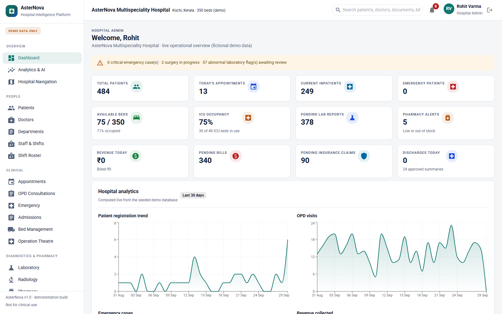 | 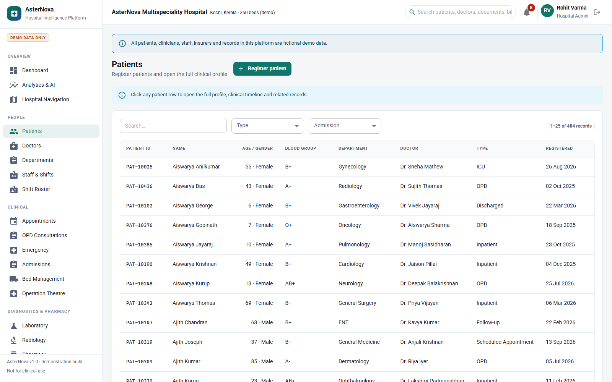 |

| Patient profile with clinical timeline | Bed management board |
| --- | --- |
| 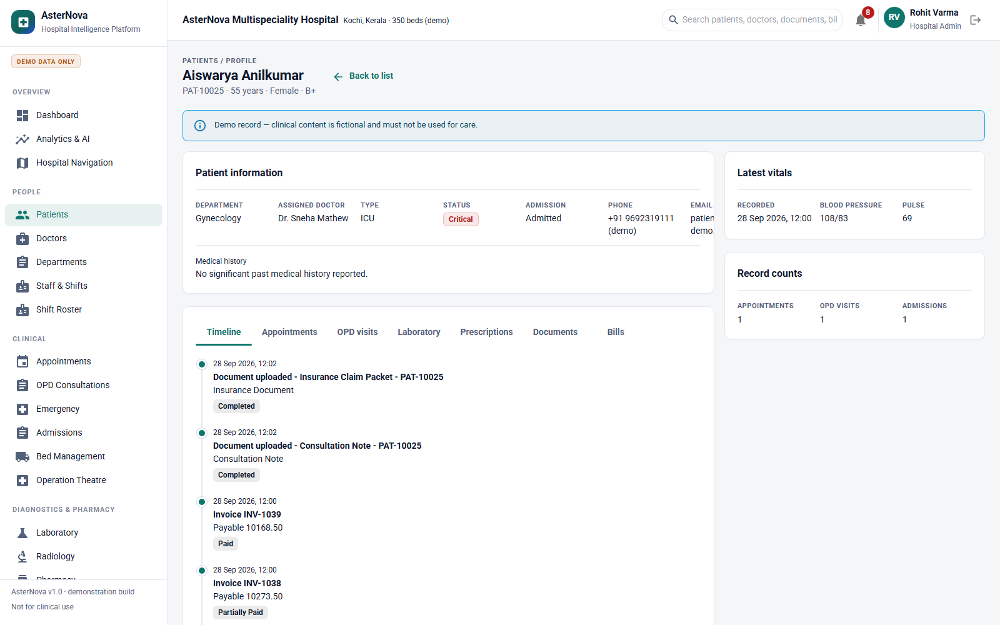 | 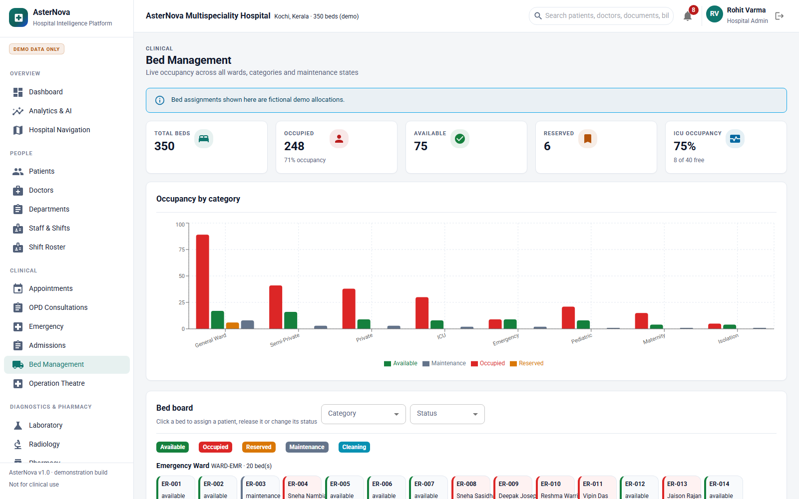 |

| Emergency triage board | Medical documents, OCR and AI |
| --- | --- |
| 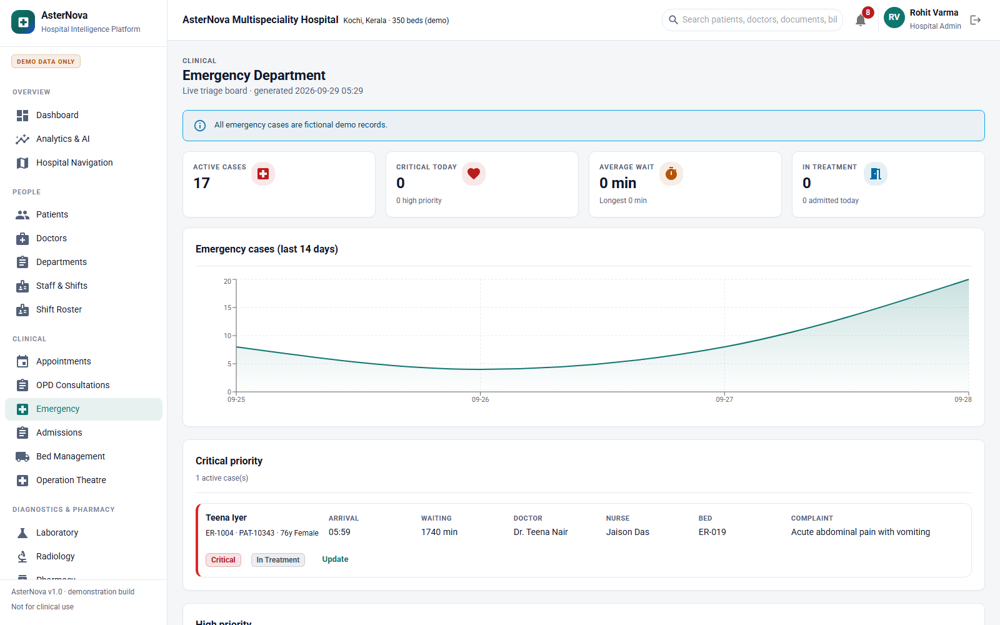 | 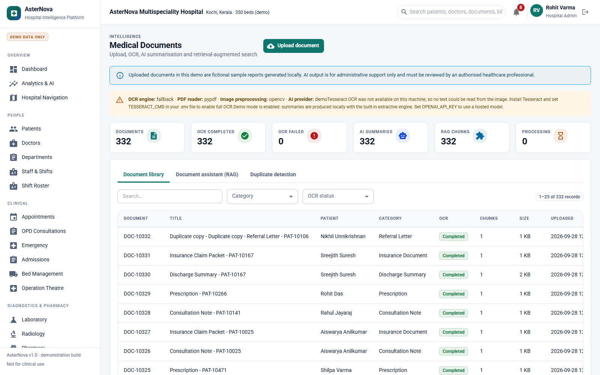 |

| AI hospital assistant | Analytics and AI forecasts |
| --- | --- |
| 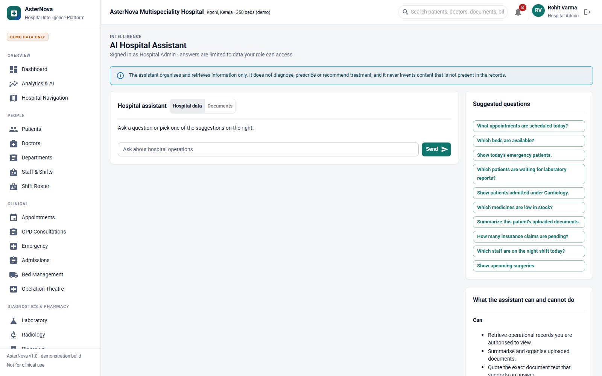 | 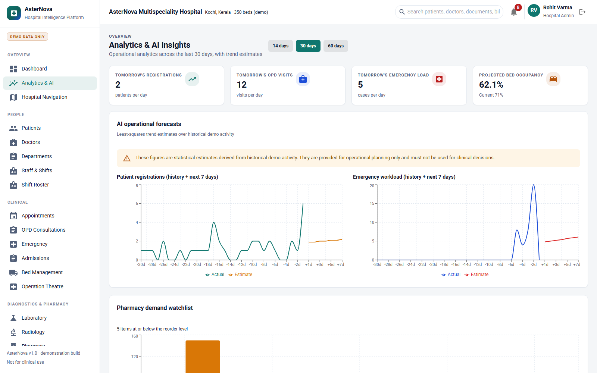 |

| Indoor navigation | Blood bank |
| --- | --- |
| 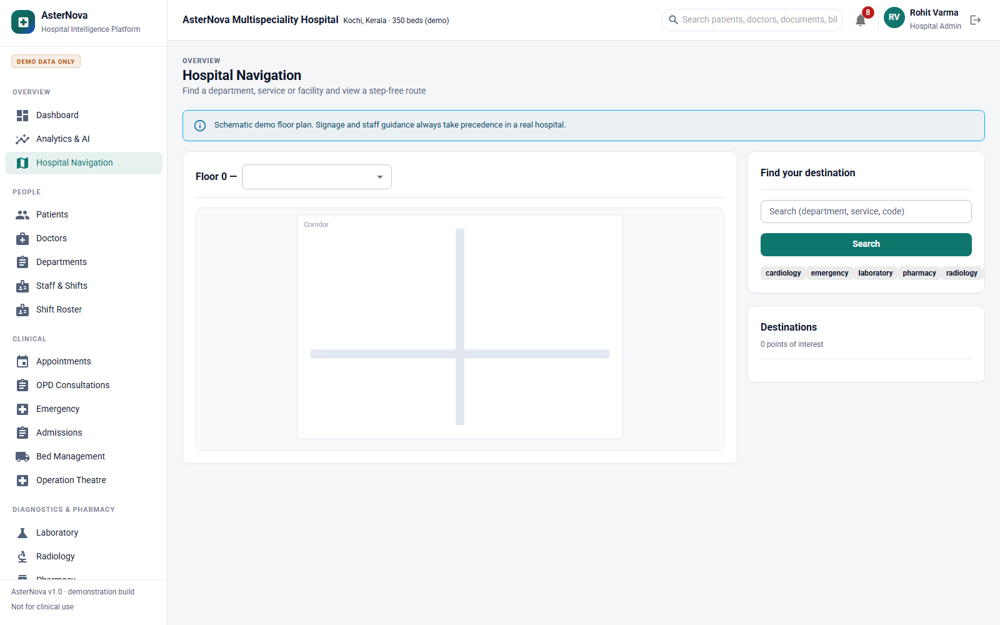 | 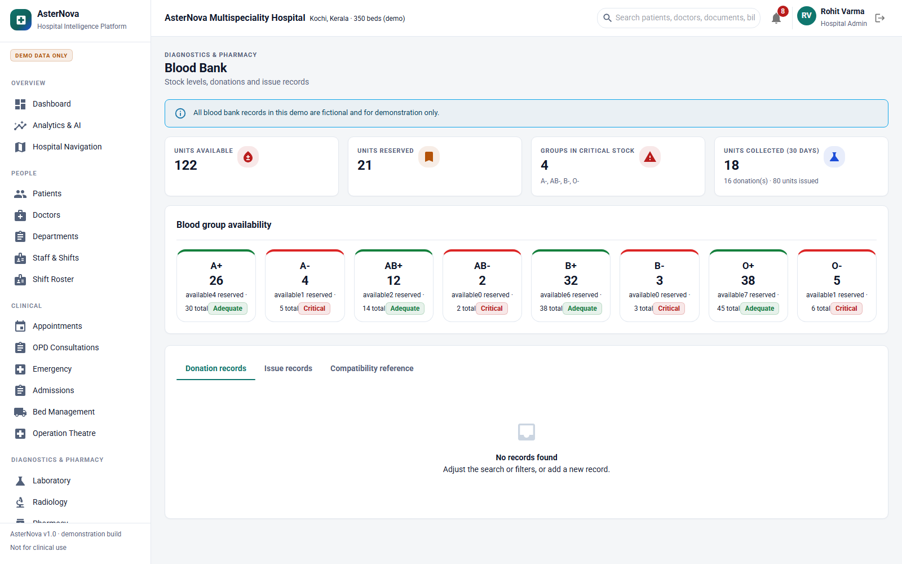 |

| Audit logs | Shift roster |
| --- | --- |
| 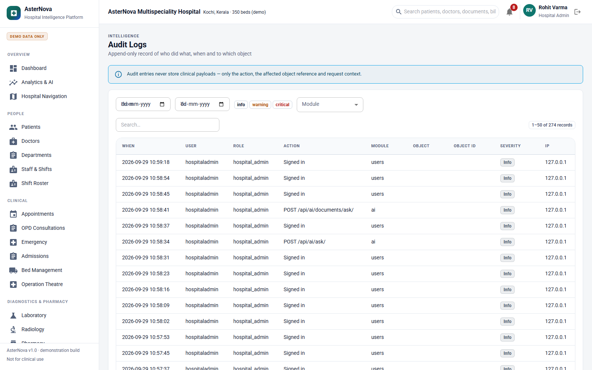 | 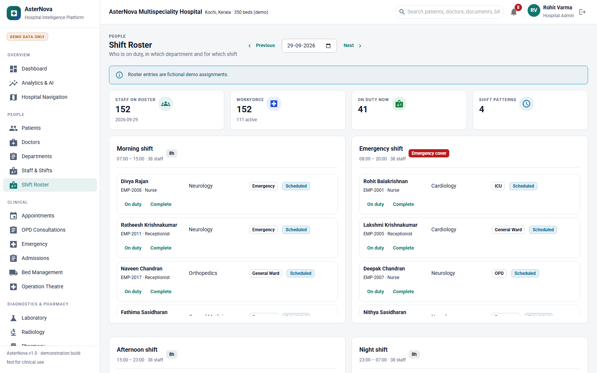 |

| Hospital settings | Patient portal |
| --- | --- |
| 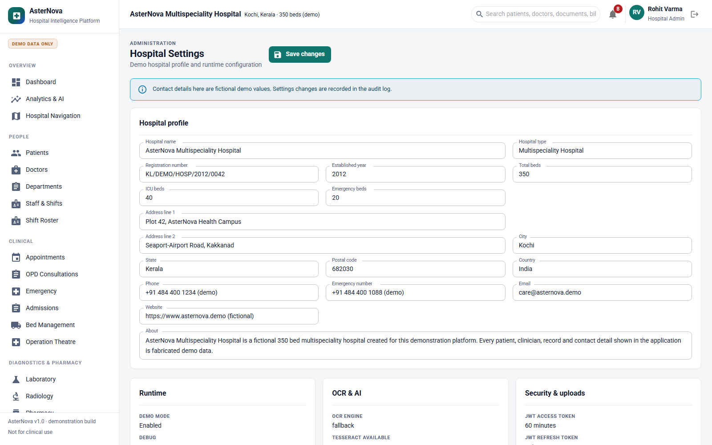 | 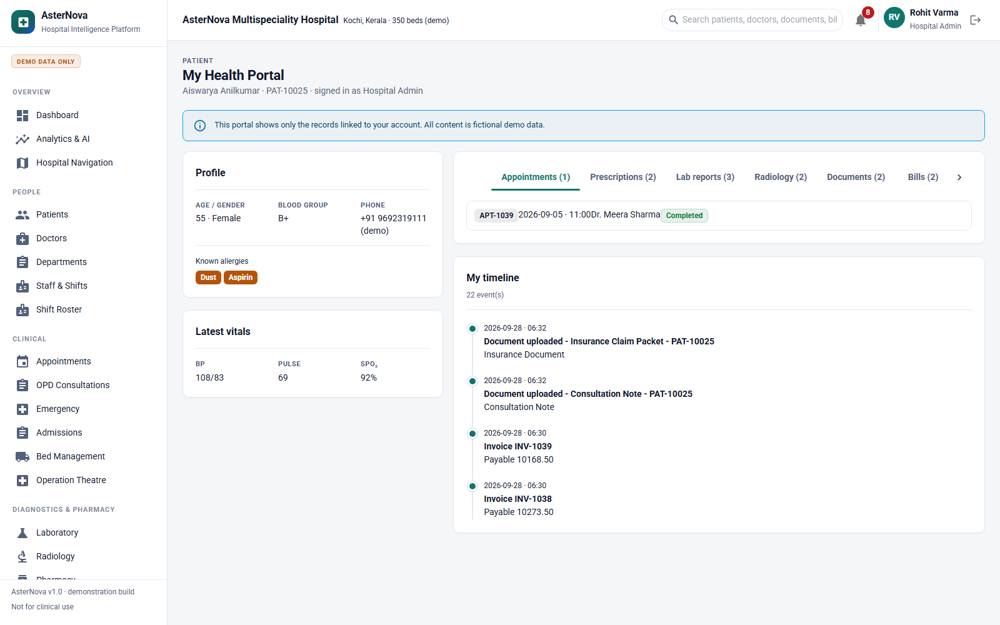 |

## Future improvements

- Move OCR and AI processing to a background worker (Celery/RQ) with progress
  streaming; the pipeline is already stage-isolated for this.
- Swap the local hashing embedder for a hosted embedding model (the RAG
  interface is a single module).
- Add WebSocket notifications instead of polling.
- Add end-to-end browser tests (Playwright) alongside the API tests.
- Add two-factor authentication for administrator accounts.
- Add PDF generation for invoices and discharge summaries.
- Add HL7/FHIR adapters for interoperability.

---

Built as a demonstration platform. All data is fictional.
